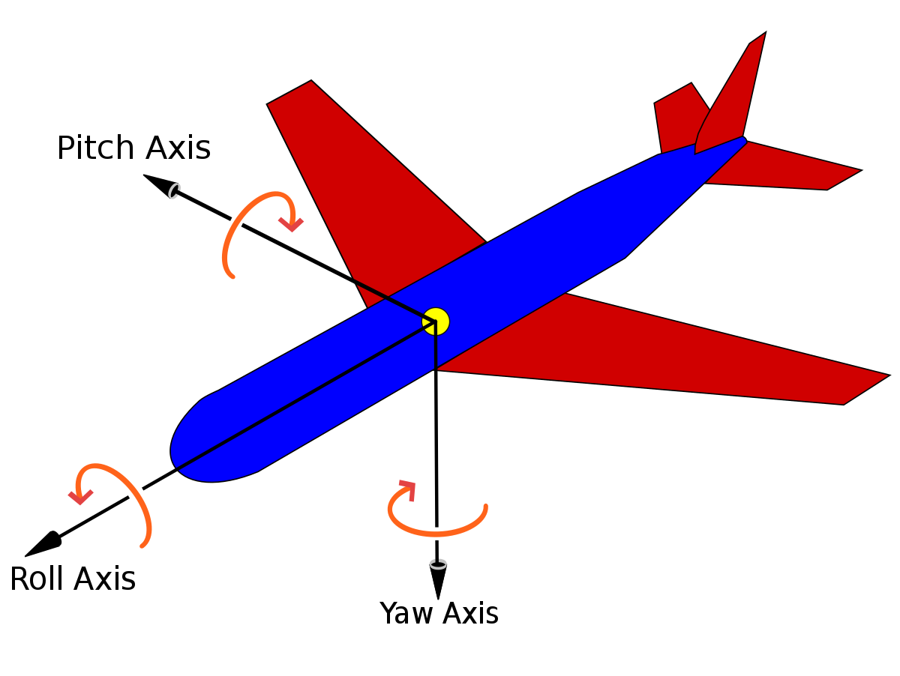

Leveraging AI to revolutionize pilot training by automating essential flight maneuvers through deep reinforcement learning.

<!--more-->

## Introduction

During my research internship at [Delphi Technology Corp.](https://delphitechcorp.com/), a Canadian startup focused on flight training, I worked on a project aimed at addressing the shortage of flight trainers by using machine learning to automate parts of the pilot training process. The goal was to reduce the dependency on human instructors by training AI agents capable of performing essential flight tasks. This initiative was driven by the need to enhance efficiency and reduce costs in the pilot training industry.

## Project Objectives

The primary objective of the project was to use machine learning, specifically deep reinforcement learning (DRL), to automate the training of new pilots. By creating an AI system that could replicate the guidance provided by human instructors, the project aimed to bridge the gap in the availability of flight trainers. Initially, the focus was on basic flight tasks, with the expectation that success in these areas would lay the foundation for more advanced training scenarios.

## Methodology

### Training AI Agents for Basic Flight Tasks

In the early stages of the project, we concentrated on training DRL agents to perform fundamental flight maneuvers such as keeping an aircraft straight and level. This involved using reinforcement learning techniques to develop an AI agent that could understand and replicate the basic skills required in flight training. The agents were trained in a simulated environment (Xplane), where their performance was continuously evaluated and refined based on their ability to maintain control of the aircraft's pitch, yaw, and roll. For example, for flying straight and level, the pitch and roll of the airplane should be nearly zero and the yaw is defined based on the point towards which the airplane is flying. These variables are shown in the below figure.

Once the DRL agent was proficient in these basic tasks, we developed a system that used the trained agent to evaluate trainee pilots. The system compared the decisions made by trainees with those of the AI agent to assess their skill levels. This approach allowed us to create a benchmark for evaluating trainee expertise, providing a consistent and objective method to measure performance.

## Challenges in Advanced Flight Training

Despite the initial success in automating basic tasks, we encountered significant challenges when attempting to extend DRL training to more complex flight maneuvers. Flight training is inherently hierarchical and logic-driven, requiring pilots to master basic skills before advancing to more intricate tasks. However, training DRL agents for these advanced tasks proved problematic. The agents often struggled with underfitting or overfitting, where they either failed to learn the necessary skills adequately or became too specialized in their training data, limiting their ability to generalize to new scenarios.

## Insights and Future Directions

The difficulties faced in training DRL agents for advanced flight tasks underscored the limitations of purely neural network-based methods in scenarios that require understanding of hierarchical and logical patterns. This experience highlighted the potential benefits of neurosymbolic methods, which combine neural networks with symbolic reasoning, in addressing these challenges. Neurosymbolic approaches could provide a more robust framework for training AI agents to perform complex tasks that require both logical reasoning and hierarchical learning, such as mastering different levels of flight maneuvers.

Moving forward, integrating neurosymbolic methods could enhance the AI training process by enabling agents to better understand and replicate the decision-making processes of human pilots. This approach could lead to more effective automation in flight training, further reducing the need for human instructors and making pilot training more accessible and cost-effective. As the project evolves, exploring these advanced methodologies will be crucial in overcoming the current limitations and achieving the broader goals of automated pilot training.